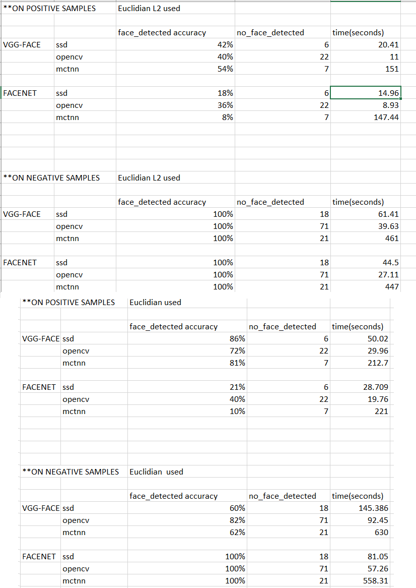

# deepface

This is a repository forked from https://github.com/serengil/deepface 
Below I share the results and some suggestions I have obtained as a result of the model performance comparisons I made to find the model I need in a real time face verification project.  <br>

## Installation

The easiest way to install deepface is to download it from [`PyPI`](https://pypi.org/project/deepface/).

```python
pip install deepface

```
## Added Features

I updated the functions.py to get information about the failiure reason of the face verification in a way that now we know if its because any face is not detected on the anchor or the sample image or even if there is detected faces, the distance between two image are bigger than the threshold so the faces are not verified.  <br>

I fixed the part where opencv's haarcascades are used for face detection by adding a convert to the 1-channel gray image before the facial cascades are applied. Because haarcascades only work on gray images properly.  <br> 

## Comparisons between Different Models where Different Backends and Distance Metrics was used

I worked with a face dataset of 4 different people, taken with a webcam and containing approximately 180 positive and negative samples with dimensions of 640 x 480. Anchor pictures are 170x226 sized passport photos of these people, while positive sample pictures are taken with a webcam in different poses (with glasses, without glasses, tied hair, untied hair, looking at slightly different angles, etc.), while negative pictures contain sample pictures of the other 3 people for each person. The below image shows my results on positive and negative samples using the default threshold of https://github.com/serengil/deepface and their durations in second  <br>  <br>

I included only VGG-Fce and Facenet in this calculation because the speed performance of Deepface and the accuracy performance of OpenFace were very low compared to other models at a faster comparison I made at the beginning.  <br>  <br>
<b><i> Model Comparison </b></i> <br>
  <br> <br>

We can see that the opencv backend are really bad for detecting faces for the first stage. I think its because the haarcascades were trained with 24x24 images and its not really
applicable to my dataset's dimensions.  <br>

We can see that euclidian distance metric is 2 times more accurate for VGG-Facenet but slow at the same proportion  <br>

We can see that mtcnn make VGG-Facenet having the best accuracy model but its too slow for a real time project in comparison with other options  <br>

After looking these results, I chose VGG-Face & EuclidiandL2 & ssd and Facenet & EuclidiandL2 & ssd for a second comparison where I change the thresholds and examine the different reactions of the models on positive and negative samples

<b><i> Threshold Comparison </b></i> <br>
  <br> <br>

After trying different thresholds, I realized that although VGG-Face seemed having the best accuracy at the first comparison, when I change the threshold in a way increasing
the accuracy on positive samples, the accuracy on negative samples decrease faster. Just the opposite, Facenet moves on in a more balanced way and reachs %72 accuracy for positive images with %100 accuracy for negative images at the same time where VGG-Face reachs %75 accuracy for positive images with %75 accuracy for negative images. 

## Result 

Facenet model with SSD backend and Euclidian distance with 1.05 threshold is my final choice to use that deepface repo. Different implementations of different repos may give different results.
I obtained this results using a intel core i7 Cpu and couldnt use with my RTX2070 GPU because of a confliction between tensorflow & tenforflow-gpu. 
After selecting the team to use, to delete all the if else implementations to make the model, distance, backend choise can improve the performance too. 


